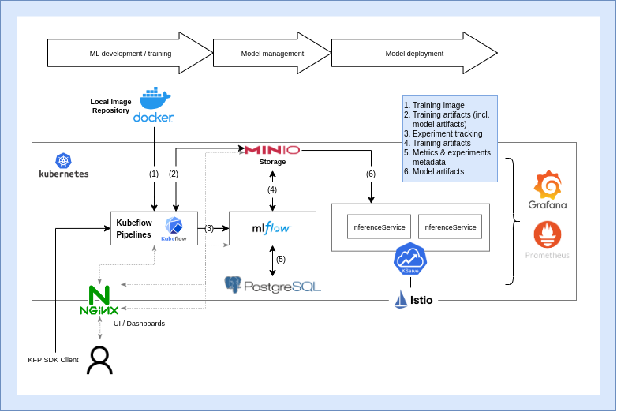

<<<<<<< HEAD
# Experimentation Platform (IML4E)

MLOps tool stack for the experimentation and training platform.

## Project structure

- [`install.sh`](install.sh): Main installation script.
- [`setup.md`](installation.md): Instructions for setting up and testing the platform.
- [`deployment/`](deployment): Kubernetes deployment manifests and configuration (IaC).
- `tutorials/`
  - [`local_deployment/`](tutorials/local_deployment): Developer's guide with step-by-step instructions for local deployment, configuration and testing of
  the different components of the platform.
- [`tests/`](): Test code to verify the deployment.

## Setup

See set up [instructions](setup.md).

### Usage examples

- [Try out MLflow](tutorials/resources/try-mlflow)
- [Try out Kubeflow Pipelines](tutorials/resources/try-kubeflow-pipelines)
- [Try out Kserve](tutorials/resources/try-kserve)

## High-level architecture

### Components

- [Kind](https://kind.sigs.k8s.io/) (cluster setup)
- [Kubernetes](https://kubernetes.io/) (container orchestrator)
- [MLFlow](https://mlflow.org/) (experiment tracking, model registry)
  - [PostgreSQL DB](https://www.postgresql.org/) (metadata store for parameters and metrics)
  - [MinIO](https://min.io/) (artifact store)
- [Kubeflow Pipelines](https://v1-5-branch.kubeflow.org/docs/components/pipelines/introduction/) (ML workflow orchestrator)
- [KServe](https://kserve.github.io/website/0.9/) (model deployment and serving)
- [Prometheus](https://prometheus.io/) (monitoring)
- [Grafana](https://grafana.com/) (monitoring and visualization)

## Contribution guidelines

**TBD**
=======
Init
>>>>>>> 1fb418d28dd4838bad4b1b75422b01ba69301b05
