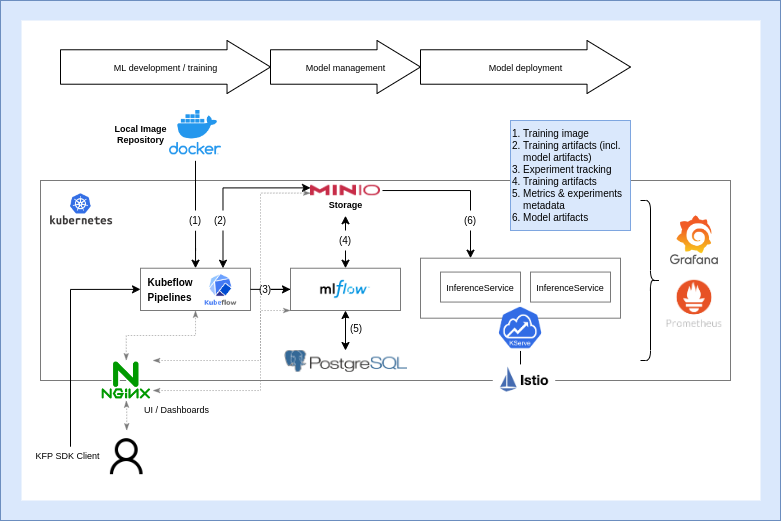

# Experimentation Platform (IML4E)

MLOps tool stack for the experimentation and training platform.


## Project structure

- [`install.sh`](install.sh): Main installation script.
- [`setup.md`](setup.md): Instructions for setting up and testing the platform.
- [`deployment/`](deployment): Kubernetes deployment manifests and configuration (IaC).
- [`tutorials/`](tutorials)
    - [`local_deployment/`](tutorials/local_deployment): Developer's guide with step-by-step instructions for local deployment, configuration and testing of the different components of the platform.
    - [`demo_pipeline/`](tutorials/demo_pipeline): Jupyter notebook with a demo pipeline that uses the installed Kubeflow Pipelines and MLflow components.
- [`tests/`](tests): Test code to verify the deployment.

## Mac Users pre-setup
> **WARNING:** If you are a Mac user, be sure to have installed the Docker Desktop app and **NOT** Rancher App, because the latter will introduce conflicts in the installation process of kubectl.

If you previously installed Rancher, uninstall it, install Docker Desktop, and update your docker context as follows:

```bash
docker context default
```

You may also save yourself some time and troubleshooting by ensuring xcode is installed correctly.

```bash
xcode-select --install
```


## Setup


Use the main installation script [`install.sh`](install.sh). Alternatively you can check a [simple summary guide](setup.md) or the [manual step-by-step setup](tutorials/local_deployment).

## Demo examples

- [Demo notebook](tutorials/demo_pipeline): Wine quality ML pipeline.
- [Demo project](https://gitlab.fokus.fraunhofer.de/iml4e/demo-fmnist-mlops-pipeline): Demo fmnist MLOPs pipeline.
- [Try out MLflow](tutorials/resources/try-mlflow)
- [Try out Kubeflow Pipelines](tutorials/resources/try-kubeflow-pipelines)
- [Try out Kserve](tutorials/resources/try-kserve)

## High-level architecture



### Components

- [Kind](https://kind.sigs.k8s.io/) (cluster setup)
- [Kubernetes](https://kubernetes.io/) (container orchestrator)
- [MLFlow](https://mlflow.org/) (experiment tracking, model registry)
  - [PostgreSQL DB](https://www.postgresql.org/) (metadata store for parameters and metrics)
  - [MinIO](https://min.io/) (artifact store)
- [Kubeflow Pipelines](https://v1-5-branch.kubeflow.org/docs/components/pipelines/introduction/) (ML workflow orchestrator)
- [KServe](https://kserve.github.io/website/0.9/) (model deployment and serving)
- [Prometheus](https://prometheus.io/) (monitoring)
- [Grafana](https://grafana.com/) (monitoring and visualization)

## Support & Feedback

Microsoft Teams channel [**#iml4e-oss-exp-platform-support**](https://teams.microsoft.com/l/channel/19%3a772dce7e4c3c43878d8a4480e8472e36%40thread.tacv2/iml4e-oss-exp-platform-support?groupId=013e128c-1864-4c5a-b81c-8dcd18638ed3&tenantId=f930300c-c97d-4019-be03-add650a171c4) (Fraunhofer)
can be used for issues, support requests or just discussing feedback.

Alternatively, feel free to use [Gitlab Issues](https://gitlab.fokus.fraunhofer.de/iml4e/iml4e_oss_exp_platform/-/issues) for bugs, tasks or ideas to be discussed.

Contact people:

- Alari Varmann - alari.varmann@silo.ai
- Joaquin Rives - joaquin.rives@silo.ai

## Contribution guidelines

**TBD**